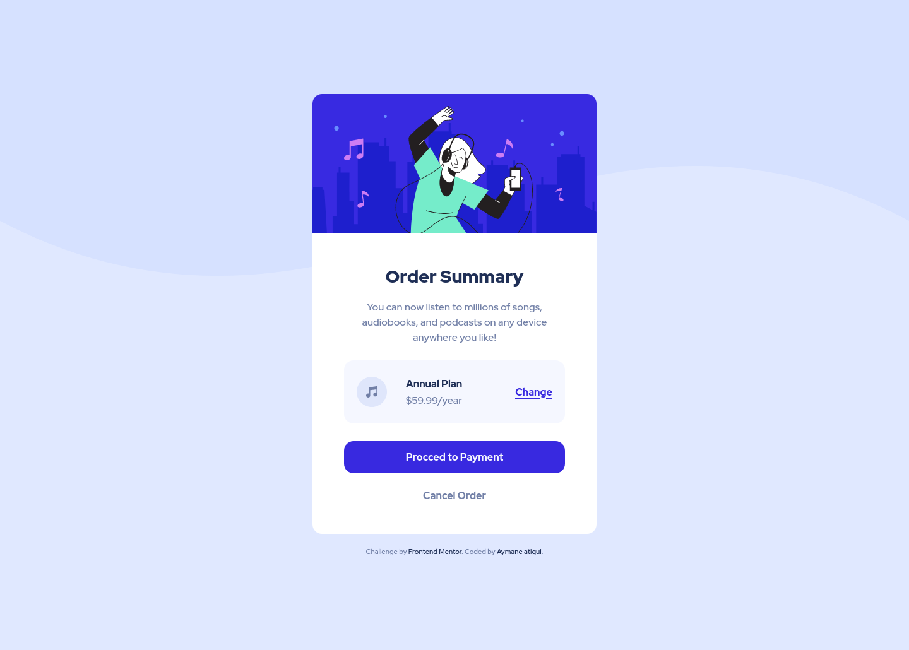
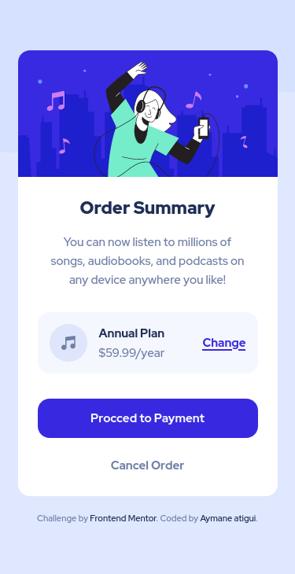

# Frontend Mentor - Order summary card solution

This is a solution to the [Order summary card challenge on Frontend Mentor](https://www.frontendmentor.io/challenges/order-summary-component-QlPmajDUj).

## Coded by [AYMANE ATIGUI](https://github.com/aymaneatigui).

- Website - [aymaneatigui.me](https://www.aymaneatigui.me)
- Frontend Mentor - [@aymaneatigui](https://www.frontendmentor.io/profile/aymaneatigui)
- Twitter - [@aymane_atigui](https://twitter.com/aymane_atigui)

## Table of contents

- [Author](#author)
- [Table of contents](#table-of-contents)
- [Overview](#overview)
  - [The challenge](#the-challenge)
  - [Screenshot](#screenshot)
  - [Links](#links)
- [My process](#my-process)
  - [Built with](#built-with)
  - [Useful resources](#useful-resources)

## Overview

### The challenge

Users should be able to:

- View the optimal layout depending on their device's screen size
- See hover and focus states for interactive elements

### Screenshot

  
  

### Links

- Solution URL: [Github](https://github.com/aymaneatigui/Frontend-Practice/tree/main/Order-summary)
- Live Site URL: [https://frontend-practice-projects.vercel.app](https://frontend-practice-projects.vercel.app/Order-summary/index.html)

### Built with

- Semantic HTML5 markup
- CSS custom properties
- Flexbox
- Desktop-first workflow

### Useful resources

- [MDN](https://developer.mozilla.org/) - This is an amazing documenting Web platform. I'd recommend it to anyone still learning Web Development.
